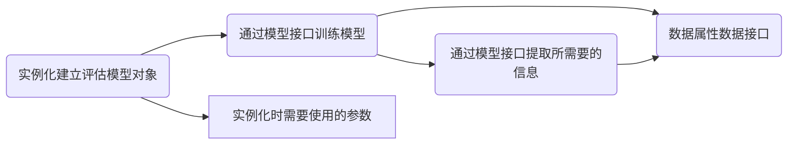
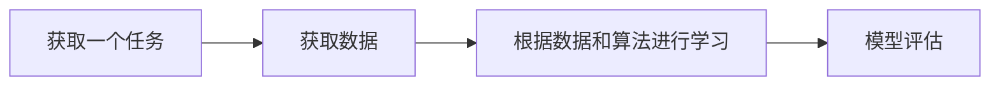
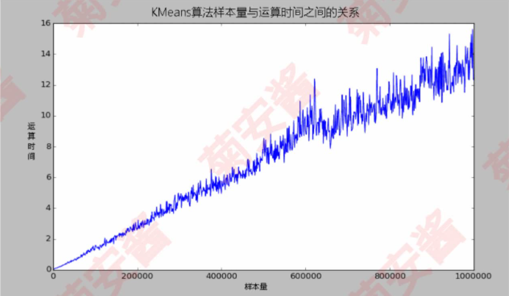

### Algorithmic Note

[toc]

参考书目：《统计学习方法》-李航

代码环境（Anaconda）：

```shell
conda create --name tensorflow2.3.1 python=3.6
conda activate tensorflow2.3.1
conda install cudatoolkit=10.1.243 cudnn=7.6.5
pip install tensorflow-gpu==2.1.0 -i https://mirrors.aliyun.com/pypi/simple/
```

```python
# 测试gpu版本是否安装成功
import tensorflow as tf

print(tf.test.is_gpu_available())
```



#### 1、概览

> 在数据分析、数据挖掘或机器学习领域，**算法用于捕捉数据背后隐藏的客观规律，去解决和实际业务高度相关的某些问题**
>
> > 某些时候算法是为了调整数据结构、降低程序的事件复杂度，提高计算机的执行效率（如*`FP-Growth`*:关联分析算法）
> >
> > 多数时候算法是为了解决最优化问题（如最小二乘法、梯度下降等）
> >
> > 更多时候算法就是一个数学模型，作用于特定的数据，产生特定的结论，解决特定的问题

##### 1.1、算法

> 算法是为了解决某个问题的固定化计算方法与步骤

##### 1.2、机器学习

> “a set of methods that can automatically detect patterns in data, and then use the uncovered patterns to predict future data, or to perform other kinds of decision making under uncertainty.”
>
> 简单来说，机器学习是一门研究让计算机学习，让计算机程序能够进化的学科



- 样本：每一条完整的数据称为一个样本
- 特征：一个样本中的各种属性称为数据的特征，也称为维度
- 标签：标签其实也为样本的一个属性，与特征不同的是标签为结果属性，而非过程属性；标签可以是样本的任一一种属性，结果属性不同而已

```
有监督学习：数据有标签的任务称为有监督学习；例如：KNN、决策树、神经网络、支持向量机、线性回归、逻辑回归等
无监督学习：数据没有标签的任务称为无监督学习；例如：聚类分析、协同过滤、关联规则、降维算法等等。。。。
```

| 算法大类       | 代表算法                                      |
| -------------- | --------------------------------------------- |
| 距离类模型     | *`KNN`*、*`K-Means`*                          |
| 线性方程模型   | 线性回归、岭回归、*`Lasso`*、弹性网、逻辑回归 |
| 规则类模型     | 树模型、*`Apriori`*、*`FP-Growth`*            |
| 条件概率模型   | 朴素贝叶斯、贝叶斯网络                        |
| 矩阵分解类模型 | *`PCA`*、*`SVD`*                              |
| 强学习器       | 支持向量机、神经网络                          |
| 集成算法       | *`Bagging`*、*`Boosting`*                     |

模型评估：

- 模型效果：模型准确率；*`AUC`*、*`F1`*、*`ROC`*
- 运算速度：在模型效果不错的情况下保证模型的运算速度是机器学习比较重要的一环
- 可解释性：在解释性需求很强的领域，可解释性就比较重要
- 服务于业务

##### 1.3、机器学习中方差和偏差的理解

>为什么要研究偏差和方差?
>
>因为我们通过机器学习方法,能够选择很多模型,不同参数的,不同超参数选择,到底哪个更适合预测呢?参数是被训练出来的,超参数是指手工调整,比如学习率,或者惩罚因子.
>
>
>
>第一张图,属于高偏差,拟合程度不高
>
>第三张图,属于高方差,拟合程度过高
>
>所以,我们就是要找第二张图的模型.

- 偏差:是衡量预测值与真实值的关系,是指预测值与真实值之间的差值.

- 方差:是衡量预测值之间的关系,和真实值无关.也就是他们的离散程度

- 误差 = 偏差 + 方差


解决方案

| 高偏差         | 高方差         |
| -------------- | -------------- |
| 增加特征       | 增加训练数据   |
| 增加多项式特征 | 减少特征数量   |
| 减少正则化程度 | 增加正则化程度 |

##### 1.4、统计学习

> 统计学习（statistical learning）是关于计算机基于数据构建概率统计模型并运用模型对数据进行预测与分析的一门学科。统计学习也称为统计机器学习

统计学习的对象是数据（data），它从数据出发，提取数据特征，抽象出数据模型，发现数据中的知识，又回到对数据的分析与预测中去。统计学习关于数据的基本假设是同类数据具有一定的统计规律性，这是统计学习的前提。这里的同类数据是指具有某种共同性质的数据。

###### 1.4.1、统计学习的目的

> 统计学习用于对数据进行预测与分析，特别是对未知新数据进行预测与分析。

#### 2、*`KNN`*

##### 2.1、概念

> ​	*`	k-近邻`*算法（*`k-nearest neighbor，k-NN`*）是以一种基本分类与回归。k近邻法的输入为实例的特征向量，对应于特征空间中的点；输出为实例的类别，可以取多类；
>
> ​	*`k近邻法`*假设给定一个训练数据集，其中的实例类别已定；分类时，对新的实例，根据其k个最近邻的训练实例的类别，通过多数表决的方式进行预测。

##### 2.2、*`k近邻`*模型的三个基本要素

> *`k近邻`*使用的模型实际上对应于特征空间的划分；模型由三个基本要素------距离度量、k值的选择和分类决策规则决定。

###### 2.2.1、模型

> *`k近邻法`*中，当训练集、距离度量（如欧氏距离）、k值及分类决策规则（如多数表决）确定后，对于任何一个新的输入实例，它所属的类唯一确定

特征空间中，对每个训练实例点x，距离该点比其他点更近的所有点组成一个区域，叫做单元（cell）。每一个实例点拥有一个电源，所有训练实例点的单元构成对特征空间的一个划分


###### 2.2.2、距离度量

> 特征空间中两个实例点的距离是两个实例点相似程度的反映。*`k近邻`*模型的特征空间一般是n维实数向量空间，使用的距离是欧氏距离，但也可以是其他距离。

- p=1时，称为曼哈顿距离(Manhattan distance)
- p=2时，称为欧式距离(Euclidean distance)
- p=∞时，它是各个坐标的最大值


###### 2.2.3、k值的选择

> k值的选择会对*`k近邻法`*的结果产生重大影响

```
近似误差(approximation error)：可以理解为对现有训练集的训练误差。
估计误差(estimation error)：可以理解为对测试集的测试误差。

近似误差关注训练集，如果近似误差小了会出现过拟合的现象，对现有的训练集能有很好的预测，但是对未知的测试样本将会出现较大偏差的预测。模型本身不是最接近最佳模型。
估计误差关注测试集，估计误差小了说明对未知数据的预测能力好。模型本身最接近最佳模型。
```

- 如果选取较小的k值，就相当于用较小的邻域中的训练实例进行预测，"近似误差"会减小，"估计误差"会增大（即训练集效果很好，但测试集会出现较大偏差）；<font color=red>如果预测附近存在噪声干扰点，那么其预测就会受其影响；</font>k值减小意味着模型变复杂，容易发生过拟合
- 如果选取较大的k值，就相当于用较大的邻域中的训练实例进行预测，"近似误差"会增大，"估计误差"会减小（即训练集效果下降，测试集效果增强），<font color=red>这时与输入实例较远的（不相似）的训练实例也会对预测起作用，使预测发生错误。</font>k值增大就意味着整体的模型变简单。
- 如果k=N，那么无论输入实例是什么，都将简单地预测它属于在训练实例中最多的类。这时，模型过于简单，忽略了训练中大量有用信息，不可取。

<font color=red>**在应用中，k值一般取一个较小的数值，通常采用交叉验证法来选取最优的k值**</font>

###### 2.2.4、分类决策规则

> *`k近邻法`*中的分类决策规则往往是多数表决，即由输入实例的k个邻近的训练实例中的多数类决定输入实例的类

##### 2.3、*`k近邻法`*的实现：*`kd树`*

> 实现*`k近邻法`*时，主要考虑的问题是如何对训练数据进行快速*`k近邻`*搜索。*`k近邻法`*最简单的实现是线性扫描（*`linear scan`*）

###### 2.3.1、构造*`kd树`*

> *`kd树`*是一种对k维空间中的实例点进行存储以便对其进行快速检索的树形数据结构。

*`kd树`*是二叉树，表示对k维空间的一个划分（*`partition`*）；这里不多叙述，需要了解请查看《统计学习方法》-李航P41

##### 2.4、使用*`KNN`*算法完成手写数字数据集的预测（*`sklearn`*实现）

>算法的计算思路，一张图像为一个矩阵，我们需要计算不同图像之间的距离关系，可以尝试这样处理，将原有的每个图像矩阵按照相同的顺序将其变换成一行或者一列向量，然后将训练的集的所有行（列）向量组成一个矩阵，来到一个新数据，将其按照相同的顺序转变为一个行（列）向量，与训练集构成的矩阵每一行（列）计算距离，得到最近的k个邻居，这k个邻居多数属于的类别，则是该新数据属于的类别。

```python
#=========================注意该代码巾作展示，无法运行=======================#
from sklearn.neighbors import KNeighborsClassifier			# 导入所需模块

k = 5													# 设置k近邻超参数
clf = KNeighborsClassifier(n_neighbors=k)                    # 实例化
clf = clf.fit(X=X_train, y=y_train)						   # 用训练集训练模型
result = clf.score(X=X_test, y=y_test)                       # 导入测试集，从接口调用返回数据
```

具体来说，*`KNN`*算法在*`sklearn`*中通过下面这个类来实现：

*`class sklearn.neighbors.KNeighborsClassifier(n_neighbors=5,*,weights='uniform',algorithm='auto',leaf_size=30,p=2,metric='minkowski',metric_params=None,n_jobs=None)`*

其中参数*`n_neighbors`*是一个超参数：最近的*`K`*个点------------><font color=red>周围几个样本（邻居）作为新样本的分类依据</font>

> 这里选择一个手写数字的数据集，来测试*`KNN`*算法在该数据集上的预测效果

导入所需的模块和库

```python
from sklearn.neighbors import KNeighborsClassifier		# 导入sklearn中的分类器
from sklearn.datasets import load_digits                 # 导入数据集
from sklearn.model_selection import train_test_split     # 导入数据处理的方式
```

查看数据详情

```python
X = data.data    				# 特征矩阵
Y = data.target                   # 标签数组
X,Y
```

图像为8x8的矩阵

进行数据细分

```python
# 将X，Y进行3：7划分测试集与训练集，期中random_state为随机数种子
X_train,x_test,Y_train,y_test = train_test_split(X,Y,test_size=0.3,random_state=1)
```

进行模型的建立

```python
clf = KNeighborsClassifier() 		# 实例化分类器
clf = clf.fit(X_train,Y_train)		# 模型训练
score = clf.score(x_test,y_test)	# 看模型在新数据（测试集）上的准确率
score							  # 0.99
```

#### 3、*`Kmeans`*

##### 3.1、聚类分析可以解决的问题和不能解决的问题

> ​	聚类分析的基本思想是**物以类聚、人以群分**，依据这个基本思想，可以将大量数据集中具有“相似”特点的数据点或者样本划分成一个类别。

​	聚类在实际工作中，常常**用于前期的探索性分析**，比如：在不知道更多的相关信息之前，针对企业整体的用户特征，可以先根据数据本身的特点使用聚类算法进行用户群分，然后针对不同群体做进一步分析；聚类也适用于样本量比较大的情况下的数据预处理工作，比如：对连续数据做离散化，方便后续做分类预测；除此之外，聚类算法还能进行图像、声音、视频等非结构化数据的压缩，节省存储空间等。

​	根据聚类算法的特点，我们可以知道，聚类分析能够解决的问题主要是：数据集可以分为几类、每个类别有多少样本量、不同类别中典型特征是什么等等。

​	但是，**聚类分析不能提供非常明确的行动指示**，聚类结果更多是为后期的分析工作提供预处理和参考，无法回答“为什么”和“怎么做”的问题，更无法为决策人员提供明确的解决问题的规则和条件。所以，可以说聚类分并不能真正的“解决”问题。

##### 3.2、在实际使用中的注意事项

> 在Kmeans聚类算法的基本原理中，我们知道KMeans聚类也是根据距离来判定数据点的相似度，那么在实际使用中就一定需要注意以下两种情况

- **数据的异常值**：在距离公式中，我们可以想象到一个异常值能够对距离计算结果产生多大的影响。可以说，异常点可以明显改变不同样本点之间的距离相似度，所以，在距离类模型中，异常值的处理是必不可少的。
- **数据量纲不统一**：假如有三个特征【商品数量】、【用户访问量】、【订单金额】，商品数量的数值分布区间是[0,10000]，用户访问量的数值区间为[1,100]，订单金额的数值分布区间是[1000,100000]，如果没有进行归一化或者标准化的操作，那么相似度将主要受到订单金额的影响，但实际情况也许这三个特征对相似度的影响都很重要

如果在实际工作中，无法满足剔除异常值、统一数据量纲，可以选择其他聚类算法，例如*`DBSCAN`*，这是一种基于密度的聚类算法，它能够把具有足够高密度的区域划分为簇，并且可以在噪声数据集中发现任意形状的簇。相对于*`KMeans`*来说，*`DBSCAN`*的优点就是对原始数据集的分布规律没有明显的要求，能适应任意数据及分布形状的空间聚类，并且不需要指定聚类数量，对噪声的过滤效果也比较好。

##### 3.3、*`KMeans`*聚类不适合超大数据集

​	*`Kmeans`*聚类算法在算法稳定性和效率上表现都还不错，但是当样本上升到一定程度的时候，KMeans算法的运行时间将是最大的瓶颈.我们来看一张图（该图绘制耗时2小时）



​	这个图表示的是在数据集包含两个特征，样本量从100增长到1000000，步长为1000，*`Kmeans`*聚类算法针对该数据集，将所有样本聚成3类的情况下，算法的运行时间与样本量之间的关系

​	从结果可以看出，在K值确定的情况下，*`KMeans`*聚类算法下运行时间基本上和数据量成线性关系，在只有两个特征的数据集上，当样本量在200000以下时，计算时间基本上都在2s以内；当样本量上升到1000000时，耗时基本上在16s左右。那么可以想象，当有更多的样本量或者K值更大的时候，*`Kmeans`*算法的运行时间将会长很多。

​	提出的一种解决方法为*`MiniBatchKMeans`*（可以自行了解）---->*`MiniBatchKMeans`*是一种能够有效应对海量数据，尽量保持聚类准确性并且大幅度降低计算时间的聚类算法

##### 3.4、聚类不是建模的终点，更多时候是重要的中间预处理过程

> 聚类分析可以将样本数据在没有标签的情况下划分成几个类别，这种划分结果可以做不同群体的差异特征分析、类别内关键特征提取等，其实在更多时候，聚类算法通常被用来作为数据处理的中间过程。

- 图像压缩
- 图像分割-----sklearn中的谱聚类（*`Spectral clustering`*）
- 异常检测-----例如：10个离群点

##### 3.5、如何选择聚类算法

- 如果数据特征比较多，那么选择谱聚类，他是子空间划分的一种，使用了降维手段，因而在处理高维度数据时计算量比传统聚类算法要小很多
- 如果数据量小于100万条，那么*`KMeans`*聚类是一个不错的选择，如果数据量大于100万条，可以考虑使用*`MiniBatchKmeans`*
- 如果数据集中有噪声点（离群点），可以使用基于密度的*`DBSCAN`*
- 如果想追求更高的分类准确率，那么选择谱聚类比*`Kmeans`*效果要好

##### 3.6、*`Kmeans`*聚类*`sklearn`*实现

```python
class sklearn.cluster.Kmeans(n_cluster=8,init='k-means++',n_init=10,max_iter=300,tol=0.0001,verbose=0,random_state=None,copy_x=True,n_jobs=None,algorithm='auto')
```

重点参数介绍如下：

| Name         | Description            | 详细解释                                                     |
| ------------ | ---------------------- | ------------------------------------------------------------ |
| n_clusters   | 聚类类别种数           | 算法要聚集的组别、类别；即K值                                |
| init         | 初始中心点创建的方法   | 一开始中心点的创建方法                                       |
| n_init       | 初始化中心点的次数     | 找多少次找到一开始的初始化中心点（5次选一个，还是10次选一个？） |
| random_state | 随机数种子             |                                                              |
| max_iter     | 最大迭代次数           |                                                              |
| tol          | 收敛的条件             | 如果两次迭代之间的差值小于tol规定的差值，那么即结束迭代      |
| algorithm    | 优化距离计算的方法选取 |                                                              |

下面用一个人造数据集来进行Kmeans算法的演示，数据集存放在testSet.txt文件中

```python
# 导入模型所需要的包
import numpy as np
import pandas as pd
import matplotlib.pyplot as plt
import sklearn.cluster;
```

```python
# 导入数据集
data = pd.read_csv("database/testSet.txt",sep='\t',header=None)         # txt文件数据的分割符为\t，且无表头
data.head()
```

```python
# 探索数据集的分布
plt.scatter(data.iloc[:,0],data.iloc[:,1])
```

```python
# 使用kmeans算法进行聚类
cluster = sklearn.cluster.KMeans(n_clusters=4)
cluster.fit(data)   # 训练模型
```

```python
# 重要属性labels_，查看聚好的类别，每个样本所对应的类
y_prd = cluster.labels_
y_prd
```

```python
# 重要属性cluster_centers_，查看质心--->第一个质心即第一簇数据在不同维度上的均值
centroid = cluster.cluster_centers_
centroid
```

```python
data.loc[y_prd==1]      # 在对数据进行聚类后，源数据已经存储了类别信息
```

```python
# 绘制不同簇的样本
color = ["red","blue","orange","green"]
for i in range(4):
    plt.scatter(data.loc[y_prd==i,0],data.loc[y_prd==i,1],c=color[i])
# 绘制不同的质心
plt.scatter(centroid[:,0],centroid[:,1],marker="x",s=100,c="black")
plt.show()
```

```python
# 获取新数据，进行聚类
cluster.predict(new_data)
cluster.fit_predict(new_data)
```

这里可以进行试验，*`KMeans`*的*`predict`*与*`fit_predict`*接口返回的结果，与直接调用属性*`labels_`*得到的结果一致，这里需要强调*`predict`*与*`fit_predict`*的使用场景：

- *`KMeans`*算法的*`predict`*接口使用场景是：数据集特别大；可以使用数据集中的一部分进行训练，然后对整体数据进行预测；

从*KMeans*算法的原理可以看出，*`KMeans`*和*`KNN`*一样都属于距离类模型，每一次迭代过程都需要计算所有样本与质心的距离，这样就会耗费非常大的计算资源。当我们的数据量非常大的时候，**为了节省计算资源，我们可以选择使用少量的数据样本来帮助我们确定质心，剩下的数据样本调用*`predict`*接口来完成簇的分类**

```python
from sklearn.cluster import KMeans
# 利用一小部分数据进行建模
cluster_small_sub = KMeans(n_clusters=4, random_state=0).fit(data[:10])
```

```python
# 绘制不同簇的样本
fig,axs = plt.subplots(1,2,figsize = (10,4))
color = ["red","blue","orange","green"]

# 使用部分数据进行建模
for i in range(4):
    axs[0].scatter(data.loc[y_pred_==i,0],data.loc[y_pred_==i,1],c=color[i])
# 绘制不同的质心
axs[0].scatter(cluster_small_sub.cluster_centers_[:,0],cluster_small_sub.cluster_centers_[:,1],marker="x",s=100,c="black")

# 使用全部数据进行建模
for i in range(4):
    axs[1].scatter(data.loc[y_prd==i,0],data.loc[y_prd==i,1],c=color[i])
# 绘制不同的质心
axs[1].scatter(cluster.cluster_centers_[:,0],cluster.cluster_centers_[:,1],marker="x",s=100,c="black")
plt.show()
```

**可以从绘制出的图像可以看出其结果是一样的**，但部分数据的建模可以节省很多的计算资源

