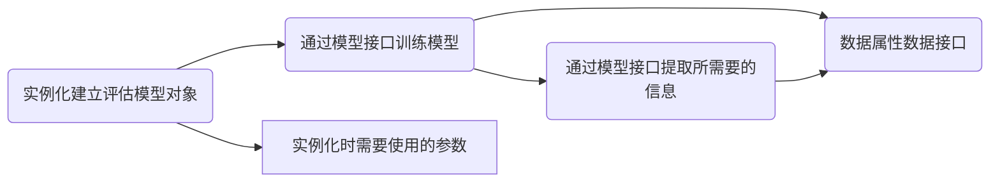
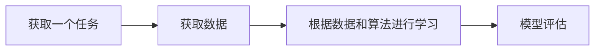

### Algorithmic Note

[toc]

参考书目：《统计学习方法》-李航

代码环境（Anaconda）：

```shell
conda create --name tensorflow2.3.1 python=3.6
conda activate tensorflow2.3.1
conda install cudatoolkit=10.1.243 cudnn=7.6.5
pip install tensorflow-gpu==2.1.0 -i https://mirrors.aliyun.com/pypi/simple/
```

```python
# 测试gpu版本是否安装成功
import tensorflow as tf

print(tf.test.is_gpu_available())
```



#### 1、概览

> 在数据分析、数据挖掘或机器学习领域，**算法用于捕捉数据背后隐藏的客观规律，去解决和实际业务高度相关的某些问题**
>
> > 某些时候算法是为了调整数据结构、降低程序的事件复杂度，提高计算机的执行效率（如*`FP-Growth`*:关联分析算法）
> >
> > 多数时候算法是为了解决最优化问题（如最小二乘法、梯度下降等）
> >
> > 更多时候算法就是一个数学模型，作用于特定的数据，产生特定的结论，解决特定的问题

##### 1.1、算法

> 算法是为了解决某个问题的固定化计算方法与步骤

##### 1.2、机器学习

> “a set of methods that can automatically detect patterns in data, and then use the uncovered patterns to predict future data, or to perform other kinds of decision making under uncertainty.”
>
> 简单来说，机器学习是一门研究让计算机学习，让计算机程序能够进化的学科



- 样本：每一条完整的数据称为一个样本
- 特征：一个样本中的各种属性称为数据的特征，也称为维度
- 标签：标签其实也为样本的一个属性，与特征不同的是标签为结果属性，而非过程属性；标签可以是样本的任一一种属性，结果属性不同而已

```
有监督学习：数据有标签的任务称为有监督学习；例如：KNN、决策树、神经网络、支持向量机、线性回归、逻辑回归等
无监督学习：数据没有标签的任务称为无监督学习；例如：聚类分析、协同过滤、关联规则、降维算法等等。。。。
```

| 算法大类       | 代表算法                                      |
| -------------- | --------------------------------------------- |
| 距离类模型     | *`KNN`*、*`K-Means`*                          |
| 线性方程模型   | 线性回归、岭回归、*`Lasso`*、弹性网、逻辑回归 |
| 规则类模型     | 树模型、*`Apriori`*、*`FP-Growth`*            |
| 条件概率模型   | 朴素贝叶斯、贝叶斯网络                        |
| 矩阵分解类模型 | *`PCA`*、*`SVD`*                              |
| 强学习器       | 支持向量机、神经网络                          |
| 集成算法       | *`Bagging`*、*`Boosting`*                     |

模型评估：

- 模型效果：模型准确率；*`AUC`*、*`F1`*、*`ROC`*
- 运算速度：在模型效果不错的情况下保证模型的运算速度是机器学习比较重要的一环
- 可解释性：在解释性需求很强的领域，可解释性就比较重要
- 服务于业务

##### 1.3、机器学习中方差和偏差的理解

>为什么要研究偏差和方差?
>
>因为我们通过机器学习方法,能够选择很多模型,不同参数的,不同超参数选择,到底哪个更适合预测呢?参数是被训练出来的,超参数是指手工调整,比如学习率,或者惩罚因子.
>
>
>
>第一张图,属于高偏差,拟合程度不高
>
>第三张图,属于高方差,拟合程度过高
>
>所以,我们就是要找第二张图的模型.

- 偏差:是衡量预测值与真实值的关系,是指预测值与真实值之间的差值.

- 方差:是衡量预测值之间的关系,和真实值无关.也就是他们的离散程度

- 误差 = 偏差 + 方差


解决方案

| 高偏差         | 高方差         |
| -------------- | -------------- |
| 增加特征       | 增加训练数据   |
| 增加多项式特征 | 减少特征数量   |
| 减少正则化程度 | 增加正则化程度 |

#### 2、*`KNN`*

##### 2.1、概念

> ​	*`	k-近邻`*算法（*`k-nearest neighbor，k-NN`*）是以一种基本分类与回归。k近邻法的输入为实例的特征向量，对应于特征空间中的点；输出为实例的类别，可以取多类；
>
> ​	*`k近邻法`*假设给定一个训练数据集，其中的实例类别已定；分类时，对新的实例，根据其k个最近邻的训练实例的类别，通过多数表决的方式进行预测。

##### 2.2、*`k近邻`*模型的三个基本要素

> *`k近邻`*使用的模型实际上对应于特征空间的划分；模型由三个基本要素------距离度量、k值的选择和分类决策规则决定。

###### 2.2.1、模型

> *`k近邻法`*中，当训练集、距离度量（如欧氏距离）、k值及分类决策规则（如多数表决）确定后，对于任何一个新的输入实例，它所属的类唯一确定

特征空间中，对每个训练实例点x，距离该点比其他点更近的所有点组成一个区域，叫做单元（cell）。每一个实例点拥有一个电源，所有训练实例点的单元构成对特征空间的一个划分


###### 2.2.2、距离度量

> 特征空间中两个实例点的距离是两个实例点相似程度的反映。*`k近邻`*模型的特征空间一般是n维实数向量空间，使用的距离是欧氏距离，但也可以是其他距离。

- p=1时，称为曼哈顿距离(Manhattan distance)
- p=2时，称为欧式距离(Euclidean distance)
- p=∞时，它是各个坐标的最大值


###### 2.2.3、k值的选择

> k值的选择会对*`k近邻法`*的结果产生重大影响

```
近似误差(approximation error)：可以理解为对现有训练集的训练误差。
估计误差(estimation error)：可以理解为对测试集的测试误差。

近似误差关注训练集，如果近似误差小了会出现过拟合的现象，对现有的训练集能有很好的预测，但是对未知的测试样本将会出现较大偏差的预测。模型本身不是最接近最佳模型。
估计误差关注测试集，估计误差小了说明对未知数据的预测能力好。模型本身最接近最佳模型。
```

- 如果选取较小的k值，就相当于用较小的邻域中的训练实例进行预测，"近似误差"会减小，"估计误差"会增大（即训练集效果很好，但测试集会出现较大偏差）；<font color=red>如果预测附近存在噪声干扰点，那么其预测就会受其影响；</font>k值减小意味着模型变复杂，容易发生过拟合
- 如果选取较大的k值，就相当于用较大的邻域中的训练实例进行预测，"近似误差"会增大，"估计误差"会减小（即训练集效果下降，测试集效果增强），<font color=red>这时与输入实例较远的（不相似）的训练实例也会对预测起作用，使预测发生错误。</font>k值增大就意味着整体的模型变简单。
- 如果k=N，那么无论输入实例是什么，都将简单地预测它属于在训练实例中最多的类。这时，模型过于简单，忽略了训练中大量有用信息，不可取。

<font color=red>**在应用中，k值一般取一个较小的数值，通常采用交叉验证法来选取最优的k值**</font>

###### 2.2.4、分类决策规则

> *`k近邻法`*中的分类决策规则往往是多数表决，即由输入实例的k个邻近的训练实例中的多数类决定输入实例的类

##### 2.3、*`k近邻法`*的实现：*`kd树`*

> 实现*`k近邻法`*时，主要考虑的问题是如何对训练数据进行快速*`k近邻`*搜索。*`k近邻法`*最简单的实现是线性扫描（*`linear scan`*）

###### 2.3.1、构造*`kd树`*

> *`kd树`*是一种对k维空间中的实例点进行存储以便对其进行快速检索的树形数据结构。

*`kd树`*是二叉树，表示对k维空间的一个划分（*`partition`*）；这里不多叙述，需要了解请查看《统计学习方法》-李航P41

##### 2.4、使用*`KNN`*算法完成手写数字数据集的预测（*`sklearn`*实现）

>算法的计算思路，一张图像为一个矩阵，我们需要计算不同图像之间的距离关系，可以尝试这样处理，将原有的每个图像矩阵按照相同的顺序将其变换成一行或者一列向量，然后将训练的集的所有行（列）向量组成一个矩阵，来到一个新数据，将其按照相同的顺序转变为一个行（列）向量，与训练集构成的矩阵每一行（列）计算距离，得到最近的k个邻居，这k个邻居多数属于的类别，则是该新数据属于的类别。

```python
#=========================注意该代码巾作展示，无法运行=======================#
from sklearn.neighbors import KNeighborsClassifier			# 导入所需模块

k = 5													# 设置k近邻超参数
clf = KNeighborsClassifier(n_neighbors=k)                    # 实例化
clf = clf.fit(X=X_train, y=y_train)						   # 用训练集训练模型
result = clf.score(X=X_test, y=y_test)                       # 导入测试集，从接口调用返回数据
```

具体来说，*`KNN`*算法在*`sklearn`*中通过下面这个类来实现：

*`class sklearn.neighbors.KNeighborsClassifier(n_neighbors=5,*,weights='uniform',algorithm='auto',leaf_size=30,p=2,metric='minkowski',metric_params=None,n_jobs=None)`*

其中参数*`n_neighbors`*是一个超参数：最近的*`K`*个点------------><font color=red>周围几个样本（邻居）作为新样本的分类依据</font>

> 这里选择一个手写数字的数据集，来测试*`KNN`*算法在该数据集上的预测效果

导入所需的模块和库

```python
from sklearn.neighbors import KNeighborsClassifier		# 导入sklearn中的分类器
from sklearn.datasets import load_digits                 # 导入数据集
from sklearn.model_selection import train_test_split     # 导入数据处理的方式
```

查看数据详情

```python
X = data.data    				# 特征矩阵
Y = data.target                   # 标签数组
X,Y
```

图像为8x8的矩阵

进行数据细分

```python
# 将X，Y进行3：7划分测试集与训练集，期中random_state为随机数种子
X_train,x_test,Y_train,y_test = train_test_split(X,Y,test_size=0.3,random_state=1)
```

进行模型的建立

```python
clf = KNeighborsClassifier() 		# 实例化分类器
clf = clf.fit(X_train,Y_train)		# 模型训练
score = clf.score(x_test,y_test)	# 看模型在新数据（测试集）上的准确率
score							  # 0.99
```

