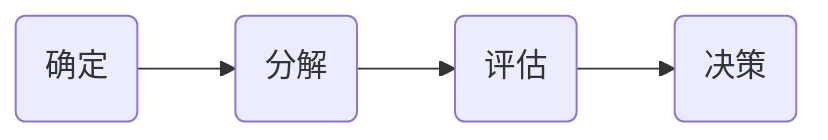

## 深入浅出数据分析

[toc]

### 1、数据分析引言（处理数据---->分解和构建数据集---->把握要害---->推进现实工作)

> 动动脑：销量与时间有关，考虑到产品的特殊性为保湿霜，冬天的目标销量应该提高，但实际销量并未达到预期销量，且还对产品做了降价销售，仍未得到明显提高，综合广告费与社会网络费来看，初步结论为社会网络宣传效果不如广告。（个人当前观点）

​	数据分析就是仔细推敲证据的过程。



基本流程如上：了解问题---》确定问题---》分解问题与数据---》评估前两步的情况作出结论---》组合结论作出一个决策

#### 1.1、确定问题->良好的分析师最终应该具有作出更好决策的能力

> 明确问题才能使更多的精力放在正确的事情上，得到的分析报告才不会冗余

明确问题的信息来源：

- 客户：这里的客户指分析结果的服务对象（上司或者你本人）-----》提高保湿霜的销量

  >提问：1、是否需要保证利润？即单价的浮动区间						 <font color=red>你希望销量提高多少</font>
  >
  >​		   2、支出的广告费用预算是否有变化									<font color=red>您觉得我们怎样才能办到呢</font>
  >
  >​           3、跟随季节变化是否更改目标销量									<font color=red>您觉得销量提高多少是可行的？目标销量合理吗？</font>
  >
  >​           4、你觉得产品的效果如何												   <font color=red>我们的竞争对手的销量如何</font>
  >
  >​           5、你觉得产品的售价是否合理									        <font color=red>广告和社会网络营销预算是怎么回事</font>

  ```
  不停问多少，可以使各种目标和确信观点得到量化
  预见客户想法，关心竞争对手情况
  对于数据的来源需要提问以至于明白
  ```

  <font color=green>可以看出自己的提问虽然有关联，但是太过模糊与泛化，不便于明确目标，可能导致产出冗余分析报告</font>

#### 1.2、把问题和数据分解为更小块（分而治之）

> 将问题细分为可管理、可解决的组块，以通过小问题找到大问题的答案

$$
我们如何提高销量=\left\{
\begin{matrix}
 我们最好的客户希望我们给他们什么 \\
 哪种促销方式最有可能产生效果\\
 我们的广告做得怎么样
\end{matrix}
\right.
$$

在数据中找到高效的<font color=red>比较因子</font>,进行有效的比较是数据分析的核心

Tips:<font color=red>红字</font>为教材上给出的观点

| 客户确信无疑的观点                                           | 我对数据的想法                                               |
| ------------------------------------------------------------ | ------------------------------------------------------------ |
| 目标群体为11~15岁的少女                                      | 销量与时间季节有关       <font color=red>2月销量比上年9月相比，有上升，但成绩平平</font> |
| 销量可以提高    <font color=red>   产品在少女销售潜力无限</font> | 销量与单价有关        <font color=red>销量与目标想去甚远</font> |
| 竞争对手现阶段比我们经营状况更好                             | 销量与广告费和社会网络费的比率有关       <font color=red>降价无助于销量达标</font> |
| 广告的宣传效果不如社会网络营销       <font color=red>重新分配广告与社会网络费</font> | 目标销量在某些时间段可以提高，某些时间段性价比较低      <font color=red>削减费用可能会影响其达标能力</font> |

<font color=green>对数据的想法太过模糊，需要就目前数据给出的事实进行总结</font>

#### 1.3、评估模块（已经知道哪些模块能让销量提高，现在需要形成自己的判断）

> 与分解模块类似，评估分解组块的关键同样在于比较

让自己介入分析，作出自己的明确假设并且以自己的信用为自己的结论打赌；客户会尊重知道数据的你给出的判断，且理解你的判断具有局限性，同时你将为自己的判断负责。

#### 1.4、决策（让客户仔细研究你对数据的评估，洞察先机，从而提出建议，作出更好决策）

> 为了这个目的，你必须将自己的设想和判断以合适的格式整合起来，供客户提取。也就是说，作品需要尽可能简单，确保自己的意见传达到位即可。

```
如何提高销量：
	在广告设计与社会网络营销方面，针对于11~15岁少女进行设计和投放；同时考虑到，目标人群大多数人为学生，应该在假期时间加大投放力度，促销等活动。
	·····销量相对目标下降可能与广告费相对从前的广告费下降有关，没有充分的证据证明社会网络建设会取得成功，建议将广告费调整到9月水平，看看反映。
```

<font color=red>!!!!!!</font><font color=green>广告费的下降与销量的关系不能经过证明，可以看出之前的假设社会网络建设效果优于广告是不可取的，进行对照实验即可检验该观点</font>

#### 1.5、回顾Review（分析模型有误）-心智模型

>数据中并未体现少女消费者市场的任何情况，但是客户假定了少女消费者是唯一的购买者。

我们又回到了起点


在这个情况下，因为数据中并没有任何的数据体现少女消费者，但我们坚信了客户的假设少女消费者作为唯一消费者，从而得到了错误的模型，这种情况被称为***心智模型***。

统计模型取决于心智模型，心智模型决定观察结果。如果采用了错误的心智模型，分析就会胎死腹中。

心智模型应当包括你不了解的因素，一定要指出不确定的因素。

<font color=green>心智模型可以用来填补对外界了解的空白，通过工作经验可以弥补盲点的发现情况</font>

> 保存好原始数据（即使是经验丰富的数据分析师也可能会犯错）
>
> 优秀的数据分析师会密切关注需要了解的数据

### 2、实验（检验理论：摆脱对观察数据的依赖---->理清因果关系）

### 3、最优化（寻求最大值---->找出解决方案和优化点）

### 4、数据图形化（数据表远非所需）

### 5、假设检验（解释假设的真实性）

### 6、贝叶斯统计（基础概率、贝叶斯规则）

### 7、主观概率（信念数字化---->标准偏差估计）

### 8、启发法（凭人类天性作分析---->经验引导）

### 9、直方图（数字的形状---->分布、差异、集中趋势）

### 10、回归（预测）

### 11、误差（指出误差范围）


