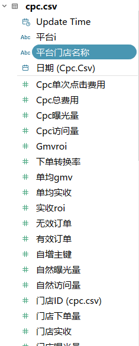

### Tableau笔记

[toc]

> 数据可视化工具，我们可以在Tableau的可视化社区学习各种顶尖的可视化方案

- **数据赋能**：让业务一线也可以轻松使用最新数据

  > 可以将数据在线发布
  >
  > 看板可以自动更新数据
  >
  > 可以下载数据
  >
  > 邮箱订阅，数据预警功能
  >
  > 可以让有权限的业务在线上编辑仪表盘

- **数据探索**：通过统计分析和数据可视化，从数据发现问题，用数据验证假设

  > 支持亿级数据的连接和处理
  >
  > 自由地对字段进行各种计算
  >
  > 拖拽就可以轻松制作图表
  >
  > 数据可以随意聚合下钻
  >
  > 图标类型可以灵活转换
  >
  > 内置算法智能建模

#### 名词解析

- 自然曝光量：总曝光量-*`cpc`*曝光量；即未花钱，平台自己带来的曝光量
- *`roi`*：投入产出比；实收*`roi`*=实收/*`cpc`*总费用
- *`order_15D`*：表示这个用户在过去15天内的下单数量（区分新用户与老用户）
- 服务费：平台抽成

#### 操作技巧

- 可以利用标记卡对图表进行美化
- 【度量】默认聚合
- 记得点击整个视图查看整个图表
- 【维度】还可以放进标记卡中对【度量】进行切分
- **离散是标签，连续是数轴**
- 维度会对度量值进行区分，增加度量值的信息密度（单个图表传达信息的多少）
- 度量值会形成图形标记，图形标记可以切换
- 按住*`CTRL`*进行拖拽是复制字段

#### 1、数据连接

##### 1.1、本地文件

- *`csv`*数据连接到文本文件
- *`xls/xlsx`*文件连接到Excel
- *`Json`*文件

##### 1.2、数据库

> 下载数据库对应的驱动后，填写地址等参数连接到对应数据库

#### 2、数据加载

- 默认使用智能连接，只需选择连接所用的数据字段即可
- 连接所用的字段可以通过函数进行计算和编辑
- 表格之间的来连接原理，*`SQL`*中会详细讲解（类似于*`SQL`*的*`out join`*操作，完全外连接）

#### 3、本项目操作

##### 3.1、连接操作

- 先连接到*`shop`*，然后拖拽*`cpc`*，选择连接字段：

  > 门店id=门店ID
  >
  > 日期=日期

- 继续拖拽*`orders`*，先于*`shop`*先连，选择连接字段

  > 门店id=门店ID
  >
  > 日期=下单日期

连接方式：**实时与数据提取区别**

- 实时：根据源数据动态变化，源数据变化即图表更新
- 数据提取：将源数据存储到Tableau内置数据中，源数据变化若未再次进行数据提取操作，图表暂不更新--->保存到**hyper文件**中

##### 3.2、提取方式

> 数据提取的编辑页面涉及到增量刷新的选项---->涉及到数据量特别大的时候才进行使用

**对工作表进行保存**：

- *`twb`*文件格式：不含有数据
- *`twbx`*文件格式：含有数据源，一打开文件即可看到数据源

**筛选器添加**：筛选器可以对目标数据源进行筛选操作--->数据源特别大，且需要分类管理时即可添加筛选器

##### 3.3、数据处理

- 可以查看数据，进行排序、重命名、拆分、数据格式改变等操作
- 这些操作在作图界面也可以完成

```
理解本次项目数据：
1、shop表数据有2385行
	数据从19年8月21号-20年9月25日
	有空值是因为当天没开店
2、cpc表有1177行
	数据从19年10月28日-20年9月25日
	部分数据与shop表相同
3、orders表有4419行
	数据从20年7uie28日-20年9月4日
	并且只有一家门店的数据
```

##### 3.4 数据可视化原理

> 人类是天生的视觉优势动物，看图比看数字快；

数据变成图标的过程就是数据映射到视觉图形的过程

**对于可视化来说，数据有【维度】和【度量】两类型，【度量】映射图形，【维度】负责区分**：

- **数值型变量【度量】Measures**：
  - 一般是由数字组成的变量；例如：成交金额，用户数，点击量
  - 数值变量可以进行计算，并基于计算结果的大小表示图表的面积大小、条形长短、颜色深浅等可以量化的视觉元素
- **类别型变量【维度】Dimensions**：
  - 类别变量包含有限的类别数或可区分组数（数值变量过多时需要进行分组）；例如：用户ID、性别、来源渠道
  - 类别变量主要用来对数值变量的计算结果进行区分，表现为图表的颜色种类、图形位置、分类方式等难以量化的视觉元素
  - 只能进行计算和分布等简单计算

Tableau会自动区分变量的类型：

上方的部分为维度型变量，下方的为度量型；颜色具有区分，上方（**蓝色**）为离散型变量，下方（**绿色**）为连续性变量

###### 数据可映射的图像类型

- 位置

  > 位置是通过将两个【度量】分别作为x坐标和y坐标确认某一【维度】变量的位置，从而形成空间关系来表现该【维度】变量的分布和趋势；例如：x坐标表示人均收入【度量】，y坐标表示人均寿命【度量】，每一个点代表一个国家【维度】，这时我们就能看到各个国家的发展水平分布
  >
  > 

  基于位置表达的散点图主要有以下四种数据规律

  

- 长度

  > 长度是直接以图形的长度来衡量【度量】的大小，并以【维度】做区分，以此实现各【维度】下对【度量】的对比分析；例如：以地区【维度】做区分，比较各地区的销售额【度量】大小
  >
  > 

- 角度

  > 角度和弧长都是用【度量】的大小直接衡量，表现细分【维度】和整体间的关系；例如：展现某一个班级里男女生【维度】的人数【度量】比例
  >
  > 注意：弧长相比于角度可以更加直接地看出部分之间的大小比较关系，从功能性上看圆环图要优于饼图
  >
  > 

- 方向

  > 方向是对趋势的描述，以折线图最为典型，以时间【维度】作为横轴，表现各时间【维度】下某一【度量】的高低变化，高低之间的连线就形成了方向；例如：以月【维度】作为横轴，统计澳大利亚的人均二氧化碳排放量【度量】
  >
  > 

- 形状

  > 形状主要用于在多组数据分析时区别组别【维度】，我们在日常使用时又称之为标记，比如散点图和折线图中的形状：在散点图里使用三种形状来表现三个各自离散的数据群
  >
  > 
  >
  > 形状也可以表示数值的类型、系列和组别，比如折线图中各系列用多种不同的形状标记
  >
  > 

- 面积和体积

  > 面积体积越大则表示【度量】越大。长度、面积、体积都可以表示数值的大小。二维平面通常用圆形和矩形，三维空间一般用立方体或球体

- 颜色和深浅

  > 饱和度和色调是两个颜色的关键要素，既可以用来区分【维度】也可以用来表示【度量】数值的高低；例如：使用颜色展现数据的典型图表热力图，通过填色，热力图能用颜色的饱和度或者色调差别来展示数值在特定地理区域（或者页面区域）的分布
  >
  > /热力图：串串香在成都的分布/((!!!!!!!真香，想回四川了))
  >
  > 

**在很多可视化规范都沿用这份清单，清单显示在可视化设计中，位置是最为精确的元素，长度其次，然后是角度和方向。**

<font color=red>依次对应数据可视化领域的四大金刚：散点图、柱状图/条形图、饼图、折线图</font>

###### 可视化字典


##### 3.5、使用Tableau将数据转化为图表

> **对【度量】和【维度】进行拖拽操作，从而完成可视化图表的制作，是被称为Tableau第一概念，是最重要的知识**-----》拒绝使用智能推荐图表

可拖拽的区域主要有以下三个：

- 行列

  > 行：将字段作为纵轴
  >
  > 列：将字段作为横轴
  >
  > 二者可以通过转置交换

- 标记卡

  > 用来切换数据对应的视觉映射类型
  >
  > 调整图表颜色、标记、大小等展示细节

- 筛选器

  > 将制定变量作为筛选条件

###### 操作步骤

> Tableau【维度】可以对【度量】进行切分

[操作步骤](https://www.baidu.com)

#### 4、图表类型区别

##### 4.1、有轴图形和无轴图形

> 有轴图像：图表具有坐标轴
>
> 无轴图形：图表不具有坐标轴

###### 有轴图形

- 折线图
- 。。。。。。

###### 无轴图形

- 饼图
- 南丁格尔玫瑰图

#### 5、基础图表制作

##### 5.1、对比分析：比大小

###### 5.1.1、柱状图

###### 5.1.2、条形图

> 条形图某种意义上是柱状图的转置

###### 创建分级结构，实现数据钻取

> 创建分级结构：品牌-门店-平台
>
> 右键品牌名称-》创建分级结构；然后就可以将属性进行拖拽；

实现数据的下钻

###### 添加筛选器，实现数据选取

###### 5.1.3、热力图（突出显示表）

###### 5.1.4、气泡图

###### 5.1.5、词云

##### 5.2、变化分析：看趋势

###### 5.2.1、折线图

> 折线图添加趋势线

###### 5.2.2、基于连续时间序列的折线图预测接下来的数据走向

###### 5.2.3、面积图

##### 5.3、构成分析：看占比

###### 5.3.1、饼图

###### 【快速表计算】

###### 5.3.2、树地图

###### 5.3.3、堆积图

##### 5.4、关系分析：看位置

###### 5.4.1、散点图

###### 【聚类分析】

###### 5.4.2、直方图

###### 5.4.3、地图

#### 6、数据可视化原则

##### 6.1、区分用户

> 可视化设计的第一步就是判断观众是谁，进而选择分析和展示角度


 ##### 6.2、主次分明，详略得当

> 强调信息的方式有很多种，用恰当的方式去强调恰当的内容


##### 6.3、真实准确

> 刻度要从0开始


##### 6.4、符合大众认知和审美习惯

> 可视化学科发展已经有很长的历史了，大众已经形成了基本的认识习惯；地理信息用地图，时间变化信息用折线图已经成了大众的习惯


##### 6.5、适度原则

> 颜色不能超过8种，不能过分强调且颜色搭配要合理
>
> 排版、字体、大小、形状等都要合适
>
> 避免使用3d效果，容易造成错觉


##### 6.6、五秒原则

> 你做的图5s内有人看懂了就成功，否则还有优化空间


##### 6.7、恰到好处的说明

> 很多时候需要对图标做出恰当的说明，帮助人们更加直接的理解信息
>
> 说明包括：标题、图例、标注、结论等


##### 6.8、少即是多

- less is more

  

- 超过8种颜色等于没有用颜色进行区分

  

##### 6.9、可视化案例

[Tableau社区](https://public.tableau.com/zh-cn/gallery/?tab=viz-of-the-day&type=viz-of-the-day)

#### 7、BI仪表盘的搭建

##### 7.1、仪表盘搭建原则

> 符合业务的阅读、思考、操作逻辑

##### 7.2、明确仪表盘主题

> 你的观众是谁？他们对什么感兴趣？

- 普通业务人员

  > > 几个跟自己业务切实相关的数据
  > >
  > > - 销售：注册-激活-成交
  > > - 投放：消耗-转化率
  > > - 运维：搬车数-换电数

- 中层管理者

  > > 整体的总结报告
  > >
  > > - 业务整体的绝对值、达成率、同比环比
  > > - 有哪些数据异常和优秀表现
  > >
  > > 各个维度的数据
  > >
  > > - 各个业务动作的绝对值、达成率、同比环比
  > > - 数据异常的具体原因

- 高层管理者

  > > 整体的总结报告
  > >
  > > - 业务整体的绝对值、达成率、同比环比
  > > - 有哪些数据异常和优秀表现

- 用人单位

  > > 有一个明确的分析主题
  > >
  > > - 分析维度越多越好
  > > - 图标越高级越好

##### 7.3、仪表盘主题拆解

> 怎样的数据能表达清楚你想说的主题

- 这个主题涉及到哪些数据

- 数据的重要程度是否相同

- 最适合数据的图表是哪一种

- 多变量分布——散点图、气泡图

  以每日营收情况主题为例

  - 关键数据

    - 营收数据

      - GMV

      - 商家实收

      - 用户实付

      - 总订单数

        - 有效订单数

        - 无效订单数

      - cpc总费用

      - 各平台数据对比

    - 流量数据

      - 曝光人数

      - 进店人数

      - 下单人数

      - 进店转化率

      - 下单转化率

      - 新客数

      - 老客数

      - 复购率

  - 数据排序
    - 营收>投放>流量

  - 图表选择

    - 经营情况总览：突出显示的文字

    - 经营数据详情：表格

    - 每日营收数据：多轴折线图

    - 每日流量数据：双轴组合图

    - 新老客占比：环形图

    - 平台占比：环形图

    - 门店排名：条形图

    - 投放情况：散点图

##### 7.4、开发设计工作表

> 怎么让工作表看起来简洁明了

- 经营情况总览：突出显示的文字

  - 将GMV拖到文本

  - 将商家实收拖拽到GMV的数字上

  - 将行的度量名称拖到列

  - 继续向度量值框内增加字段

    - 曝光人数

    - 进店人数

    - 下单人数

    - 无效订单数

    - 商户补贴

    - 平台补贴

    - cpc总费用

  - 添加时间筛选，应用到全局
    - 19年10月28日-20年9月25日

- 经营数据详情：表格

  - 复制经营情况总览

  - 拖拽日期到天，选择连续天，在选择离散

- 每日营收数据：多轴折线图

  - 右键日期，创建自定义日期，选择天

  - 拖拽日期到列

  - 拖拽GMV到行

  - 拖拽商家实收、平台补贴到纵轴

- 每日流量数据：双轴组合图

  - 拖拽日期（天）到列

  - 创建计算字段

    - 进店率
      - SUM([进店人数])/SUM([曝光人数])

    - 右键进店率字段-默认属性-数字格式
      - 选择百分比

    - 复制进店率

      - 修改列名为成交率

      - 下单人数替换进店人数

      - 进店人数替换曝光人数

  - 成交率到行，进店率到纵轴

  - 曝光人数到行

  - 右键曝光人数-双轴

  - 修改曝光人数图层标记为条形图

  - 在行拖拽字段改变图层顺序

- 新老客占比：环形图

  - 创建计算字段

    - 新老客

    - IF IFnull ([order_90d],0) = 0 then '新客'

    - else '老客'

    - end

  - 新老客拖拽到颜色

  - orders表的计数到大小

  - 选择饼图

  - 整个视图

  - 增加百分比、新老客标签

  - 绝对值拖拽到工具提示

  - 在行输入两个0

  - 双轴修改图层

  - 隐藏纵轴标题

  - 设置格式-线-零值线无

- 平台占比：环形图

  - 复制新老客占比

  - 想想怎么改

  - 右键平台，进行别名

- 门店占比：环形图

  - 复制平台占比

  - 想想怎么改
    - 门店名称替换平台即可

- 投放情况：散点图

  - cpc总费用到列

  - 商家实收到行

  - 日期（复制）到详细信息和标签

  - 品牌名称到颜色

  - 添加趋势线

- 订单分布：面积图

  - 下单日期到列-连续天

  - orders计数到行

  - 下单日期时间到颜色-离散小时

  - 标记选为区域

- 配送分布：地图

  - 双击配送坐标-经度/纬度

  - 下单日期时间（复制）到详细信息

  - 排除异常数据

  - 右键距离，创建组

  - shift多选后命名分组

  - 将距离-组拖拽到颜色

##### 7.5、构思仪表盘布局

- 纵向布局
  - 从上到下按逻辑展开
- 横向布局
  - 有一到两个主图，其他补充信息
- 没有很好的想法，可以多去社区找灵感
  - https://public.tableau.com/zh-cn/gallery/?tab=viz-of-the-day&type=viz-of-the-day

##### 7.6、加“亿点点”细节

- 联动筛选

- 边框

- 简化

  - 筛选器

  - 网格线

- 填充

  - 使用空白调整布局

- 字体

  - 标题尽量统一为微软雅黑

- 配色

  - 修改工作表颜色

  - 修改仪表盘底色

  - 配色方案

    - 取logo颜色

    - 纯深色or纯暖色

      - 

      - 

    - 参考设计网站

      - 设计师必存的101种配色方案
        - https://mp.weixin.qq.com/s?__biz=MzA5NjU0NzIwNg==&mid=2650036415&idx=1&sn=3b5e72771bfec0d960d0e01710493053&chksm=88ae8056bfd90940d20db9f21e4d7fc9c17f21db8a0927141ad460d07e5163e92280be065e0d&mpshare=1&scene=24&srcid=0426d8DyZclI6CJVxZDf02WZ&key=f4f55a58660f93ccce2c1deaa55ffabaf90aecf722a158bd56bc701eb12fd0885caeff730049d94374d5e5ea4e4e202bba884f47bf6e79d8fd995aabd0fe0ae767b1953e1de9ebe71c1180d2bac34cbc&ascene=1&uin=NjUxNTQzMDA1&devicetype=Windows+10+x64&version=62090070&lang=zh_CN&exportkey=A%2BuM0BhkPclQXhoZDf6l7Mo%3D&pass_ticket=5H0yKOohxiKsClwYcnWMWFj%2FgWFhPGGnKVKKH8udgafp%2FaOmL7VZ8Xr6Bnpg8ue2

      - Pinterest

      - dribbble

      - 站酷

- 最终结果

  - 


​	

